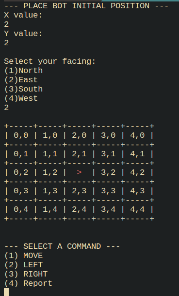
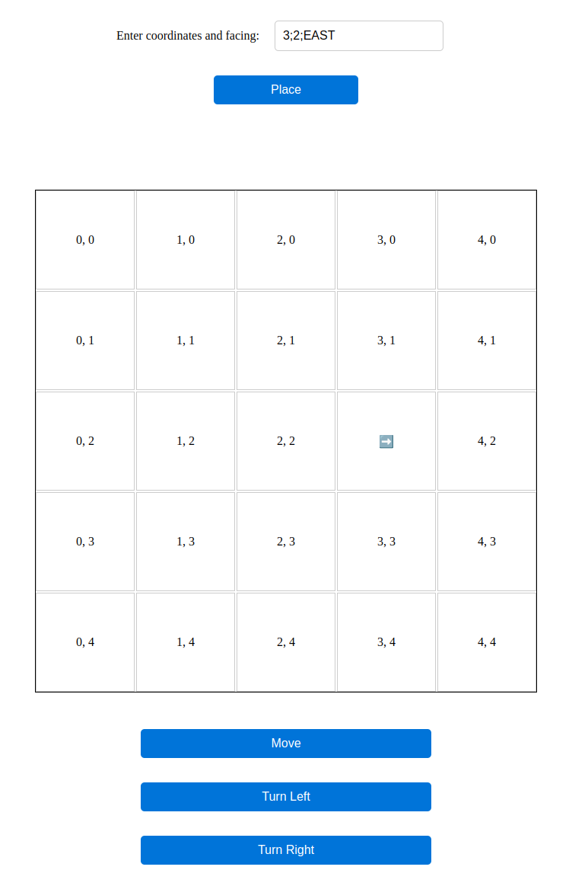

## Running the application

### CLI

The CLI version was written in golang to align with the stack that were presented on previous talk (Node, Go).
There's an executable "./cli/pin-people-robot" that can run on terminal without the necessity of build and does not require Go to be installed, just run it.



### Web

The Web version is written in javascript using a basic html and css to show, in real, time robot placement and direction in addition to it's movement updates.To run it you need to have node installed and run the commands to install dependencies and run script inside /web folder

```
 npm i && npm run dev
```

that will open a server on http://localhost:8080/ with the UI ready to receive commands

Obs: input expects 0;0;FACING pattern. Ex: 0;0;EAST



# Toy Robot Simulator

## Table of contents:

- [Description](./README.md#description)
  - [Constraints](./README.md#constraints)
  - [Example Input and Output](./README.md#example-input-and-output)
  - [Deliverables](./README.md#deliverables)

## Description

- The application is a simulation of a toy robot moving on a square tabletop, of dimensions 5x5. Having a CLI option and also a web version.

- There are no other obstructions on the table surface.

- The robot is free to roam around the surface of the table, but must be prevented from falling to destruction. Any movement that would result in the robot falling from the table must be prevented, however further valid movement commands must still be allowed.

Create an application that can read in commands of the following form:

### Command Line Interface (CLI)

```
PLACE X,Y,F
MOVE
LEFT
RIGHT
REPORT
```

- `PLACE` will put the toy robot on the table in position X,Y and facing NORTH, SOUTH, EAST or WEST.

- The origin (0,0) can be considered to be the NORTH WEST most corner.

- The first valid command to the robot is a `PLACE` command, after that, any sequence of commands may be issued, in any order, including another `PLACE` command. The application should discard all commands in the sequence until a valid `PLACE` command has been executed

- `MOVE` will move the toy robot one unit forward in the direction it is currently facing.

- `LEFT` and `RIGHT` will rotate the robot 90 degrees in the specified direction without changing the position of the robot.

- `REPORT` will announce the X,Y and F of the robot. This can be in any form, but standard output is sufficient.

- A robot that is not on the table can choose to ignore the `MOVE`, `LEFT`, `RIGHT` and `REPORT` commands.

- Inputs could be from a file or STDIN, as the developer chooses.

- Provide test data to exercise the application.

### WEB

You have to create a simple (no complex layout needed) web application, showing the table and the position and direction of the robot on the table (if robot already placed on table). All commands must update robot position, in other words, the command's output should be visible on the table, invalidating the necessity of the `REPORT` command.

You are free to decide how to receive commands, being it in batches or individually, but the commands must be "processed" individually. Meaning all commands must update the robot position on the table in a way the user can understand the path the robot is following.

- All commands (except `REPORT` which is unnecessary for the Web Version) should work exactly as on the CLI.

### Constraints

- The toy robot must not fall off the table during movement. This also includes the initial placement of the toy robot.

- Any move that would cause the robot to fall must be ignored.

### Example Input and Output:

#### Example a

    PLACE 0,0,SOUTH
    MOVE
    REPORT

Expected output:

    0,1,SOUTH

#### Example b

    PLACE 0,0,SOUTH
    LEFT
    REPORT

Expected output:

    0,0,EAST

#### Example c

    PLACE 1,2,EAST
    MOVE
    MOVE
    RIGHT
    MOVE
    REPORT

Expected output

    3,3,SOUTH

### Deliverables

Please provide your source code, and any test code/data you used to
build your solution.

Please engineer your solution to a standard you consider suitable for
production. It is not required to provide any graphical output showing the
movement of the toy robot on the CLI, only on the web.
